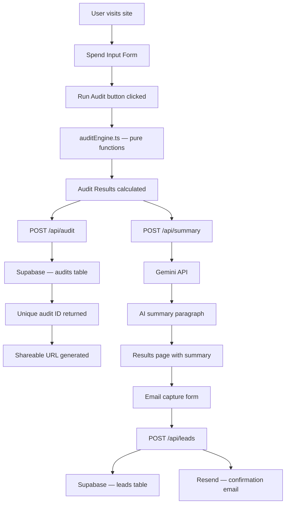

# Architecture

## System Diagram

---

## Data Flow

1. **User fills form** — tool name, plan, seats, monthly spend, team size, use case. State saved to localStorage on every change so it persists across reloads.

2. **User clicks Run my audit** — `runAudit()` in `lib/auditEngine.ts` runs instantly in the browser. Pure function, no API call needed for the core logic.

3. **Audit saved to Supabase** — `POST /api/audit` saves the full audit object to the `audits` table and returns a UUID.

4. **URL updated** — browser URL changes to `/audit/{uuid}` without a page reload using `window.history.pushState`.

5. **AI summary fetched** — `POST /api/summary` sends the audit data to Gemini API and returns a ~100-word personalized paragraph. Falls back to a templated summary if the API fails.

6. **Results displayed** — savings hero, per-tool breakdown, AI summary, email capture form, share link.

7. **Email captured** — `POST /api/leads` saves the lead to Supabase and sends a confirmation email via Resend.

8. **Shareable URL** — `/audit/{uuid}` is a public server-rendered page. PII (email, company name) is stripped — only tools and savings numbers are shown.

---

## Stack Choices

### Frontend — Next.js 15 + TypeScript
Next.js App Router gives server-side rendering for shareable audit pages, which is required for Open Graph previews. TypeScript catches bugs at compile time and makes the codebase easier to maintain.

### Styling — Tailwind CSS
Utility-first CSS lets us move fast without writing custom CSS files. No design system overhead for a one-week project.

### Database — Supabase
Postgres database with a REST API and generous free tier. Row-level security can be added later. The Supabase dashboard lets the Credex sales team view leads without building an admin panel.

### AI Summary — Gemini 1.5 Flash
Free tier with generous rate limits. Used only for the summary paragraph — the audit logic itself is hardcoded rules, which are more defensible for financial reasoning.

### Email — Resend
Simple REST API for transactional email. Free tier covers 3,000 emails/month which is sufficient for an MVP.

### Deployment — Vercel
Zero-config deployment for Next.js. Auto-deploys on every push to main. Free tier covers the expected traffic for an MVP launch.

---

## File Structure

---

## What I would change for 10,000 audits per day

1. **Add a Redis cache** — cache audit results by input hash so identical inputs don't hit Supabase every time. Most audits from the same company will have identical tool stacks.

2. **Move AI summary to a background job** — currently the summary blocks the results render. At scale, queue it with a job runner (like Inngest or Trigger.dev) and update the UI when it completes.

3. **Add a CDN for the shareable pages** — `/audit/[id]` pages are currently server-rendered on every request. At scale, cache them at the edge with `revalidate` since audit results never change.

4. **Rate limiting on API routes** — currently only the leads route has abuse protection. At 10k audits/day, add rate limiting on `/api/audit` and `/api/summary` using Upstash Redis.

5. **Separate read and write databases** — use Supabase read replicas for the shareable audit pages so writes (new audits) don't slow down reads (viewing shared audits).